# Data model

A UML/ER overview of **the platform's core schema** — the net Postgres schema
after the open Liquibase master under
`backend/core/src/main/resources/db/changelog/changes/` and, where the paid overlay is
present, its own changelog under `tessary-paid/db` are applied. Not exhaustive — see the
SQL baseline for the full table list.

> **Keep this in sync.** Whenever you add, drop, or meaningfully alter a table or
> relationship in a migration, update the diagram and the inventory below **in the same
> change** (see [`../guides/common-tasks.md`](../guides/common-tasks.md) → "Schema change").

> **Migration numbers below `0000-baseline`** (e.g. `0085`, `0089`, `0092`–`0095`) are
> historical citations from before the 2026-08-15 baseline squash (commit `f858d66a`), not
> live files. A second squash (2026-09, #1074) folded that baseline's own `0001`–`0016`
> follow-on chain back in (`0016` is epic 8 Track A's removal, PR #1095, which landed BEFORE
> the partition, the reverse of epic 3's working assumption, so the fold absorbed it too) and,
> in the same commit, partitioned the schema: 15 paid-owned tables (see the open-core program
> doc's component ledger) moved out to the paid overlay's own `P0000-paid-baseline.sql`,
> applied by a second Liquibase bean strictly after the open one, and two dead tables plus the
> (already-unread) `classifier_detection_v` view were dropped outright. The net schema this
> page describes is the open master (`0000-baseline.sql`) plus that overlay; rows marked
> **Paid.** live in the overlay. Neither lane has a changeset below its baseline: the
> `0017`–`0023` chain was folded into `0000-baseline.sql` for the public cutover (#1144), so the
> open master declares exactly one include and the overlay master one more. New open migrations
> number from `0024`, new paid ones from `P0001` in `tessary-paid/db`. Every migration number in
> the rationale prose below — the pre-2026-08 ones, `0001`–`0016` and `0017`–`0023` alike — no
> longer resolves to anything on disk; kept because it explains *why* a column or table looks the
> way it does.

**Skim:** [How to read](#how-to-read-it) · [Diagram](#diagram) · [Inventory](#table-inventory-by-domain) · [Notes](#notes--gotchas)

## How to read it

- **Project-scoped by default.** Almost every business table has `project_id` → `project` → `organization`. Tenancy/auth is the exception.
- **Slug-id pipeline tables use composite `(project_id, id)` PKs** (`call_site`, `chain`, `grader_failure_mode`) — producer-chosen slugs recur across projects. Detected `failure_mode` uses a single ULID PK. Soft (dotted) edges = app-enforced TEXT refs, not DB FKs. Details in [Notes](#notes--gotchas).
- **Substrate identity is the producer's, scoped by project.** `session`, `trace` and `span` are keyed on `(project_id, <the id the producer sent>)` — the OTel trace id, the OTel span id, the session string — with no platform-minted surrogate anywhere in the substrate. A span's full key is `(project_id, trace_id, id)`: a span id alone is half a key.
- **There is no environment scope.** Track A removed the concept: a project is the only scope below an org, and `0016` dropped the `environment` table plus the `environment_id` column from `session`, `trace`, `span`, the (since-removed, `0017`/#1116) `embedding`, `api_key` and `metric_rollup`.
- **Typed subject grains** on subject-bearing tables: `session_id` (the session, or the trace when the producer sent no session) + optional `trace_id`/`span_id` + CHECK, with a `subject_kind` of `session`/`trace`/`span`. `0094` renamed the columns off v1's `context_id`/`observation_id` and migrated the discriminator to match — the all-databases reset is the sanctioned exception to the never-rename-a-persisted-string rule (PLAN-1 §0). Governance rows may still use `(subject_kind, subject_id)`.
- **Storage shapes.** ids are TEXT (ULIDs). Substrate + judgment core: `TIMESTAMPTZ` + `JSONB`. Ops/governance/alert/job: TEXT ISO-8601 timestamps.

## Diagram

```mermaid
erDiagram
    %% ===== Tenancy / Auth =====
    principal {
        TEXT id PK
        TEXT workos_user_id
        TEXT email
        TEXT kind
        TEXT parent_principal_id FK
        TEXT status
    }
    organization {
        TEXT id PK
        TEXT slug
        TEXT archived_at
    }
    org_membership {
        TEXT org_id PK,FK
        TEXT principal_id PK,FK
        TEXT role
        JSONB scopes
    }
    org_invitation {
        TEXT id PK
        TEXT org_id FK
        TEXT invited_by FK
        TEXT email
    }
    project {
        TEXT id PK
        TEXT org_id FK
        TEXT slug
        BOOLEAN is_default
    }
    api_key {
        TEXT id PK
        TEXT project_id FK
        TEXT principal_id FK
        TEXT token_prefix
        TEXT scope
        TEXT expires_at
    }
    provider_credential {
        TEXT id PK
        TEXT org_id FK
        TEXT project_id FK
        TEXT provider
    }
    project_model_setting {
        TEXT project_id PK,FK
        TEXT lane PK
        TEXT model_key
        TEXT service_tier
    }
    audit_log {
        TEXT id PK
        TEXT project_id FK
        TEXT organization_id FK
        TEXT principal_id
        TEXT subject_kind
        TEXT subject_id
        TEXT occurred_at
    }
    prior_consent {
        TEXT org_id PK,FK
    }
    prior_contribution {
        TEXT id PK
        TEXT org_id FK
        TEXT feature_key
    }
    org_feature_flag {
        TEXT org_id PK,FK
        TEXT flag_key PK
        BOOLEAN enabled
        TEXT created_at
        TEXT updated_at
    }

    organization ||--o{ org_membership : "has members"
    principal    ||--o{ org_membership : "belongs to"
    principal    ||--o| principal : "acts on behalf of"
    organization ||--o{ org_invitation : "invites"
    principal    ||--o{ org_invitation : "invited by"
    organization ||--o{ project : "owns"
    project      ||--o{ api_key : "issues"
    principal    ||--o{ api_key : "created by"
    organization ||--o{ provider_credential : "has credentials"
    project      ||--o{ project_model_setting : "pins lane models"
    organization ||--o{ audit_log : "governs"
    project      ||--o{ audit_log : "scopes"
    organization ||--o| prior_consent : "opts in"
    organization ||--o{ prior_contribution : "contributes"
    organization ||--o{ org_feature_flag : "overrides"

    %% ===== Ingestion / Sources =====
    ingestion_source {
        TEXT id PK
        TEXT project_id FK
        TEXT provider
        TEXT name
    }

    project          ||--o{ ingestion_source : "configures"

    %% ===== Pipeline content (per-project synthesized) =====
    pipeline_meta {
        TEXT project_id PK,FK
        TEXT version
        TEXT synced_commit_sha
    }
    call_site {
        TEXT id PK
        TEXT project_id PK,FK
        TEXT model
        TEXT invocation
    }
    chain {
        TEXT id PK
        TEXT project_id PK,FK
    }
    grader_failure_mode {
        TEXT id PK
        TEXT project_id PK,FK
        TEXT call_site_id
        TEXT grader_id
    }
    sop_document {
        TEXT id PK
        TEXT project_id FK
        TEXT call_site_id
        TEXT content_digest
    }
    sop_judge_label {
        TEXT id PK
        TEXT project_id FK
        TEXT call_site_id
        TEXT trace_id
        TEXT labels_json
    }

    project ||--o| pipeline_meta : "has"
    project ||--o{ call_site : "discovers"
    project ||--o{ chain : "detects"
    project ||--o{ grader_failure_mode : "grader targets"
    project ||--o{ sop_document : "stores SOPs"
    project ||--o{ sop_judge_label : "keeps judge labels"

    %% ===== Telemetry substrate (run-independent, append-only) =====
    %% Three levels, fixed: session -> trace -> span. Sessions never nest; spans nest only
    %% within their own trace. Every key is the producer's own id, led by project_id.
    project_version {
        TEXT id PK
        TEXT project_id FK
        TEXT commit_sha
    }
    session {
        TEXT project_id PK
        TEXT id PK
        TEXT user_id
        TIMESTAMPTZ started_at
        TIMESTAMPTZ last_activity_at
    }
    trace {
        TEXT project_id PK
        TEXT id PK
        TEXT session_id FK
        TEXT parent_trace_id FK
        TEXT thread_id
        TEXT name
        TEXT project_version_id
        TEXT call_site_id
        TIMESTAMPTZ started_at
        TIMESTAMPTZ ended_at
        BIGINT latency_ms
        INTEGER span_count
        BIGINT total_tokens
        NUMERIC total_cost
        INTEGER unpriced_spans
        TIMESTAMPTZ rollup_due_at
        BOOLEAN is_settled
    }
    span {
        TEXT project_id PK
        TEXT trace_id PK
        TEXT id PK
        TEXT parent_span_id FK
        LTREE path
        TEXT session_id
        TEXT call_site_id
        TEXT kind
        TEXT name
        TEXT error_type
        TEXT error_message
        TIMESTAMPTZ started_at
        BIGINT latency_ms
        TEXT model_id FK
        BIGINT total_tokens
        NUMERIC total_cost
        TEXT cost_source
        TEXT price_book_version FK
    }
    span_payload {
        TEXT project_id PK
        TEXT trace_id PK
        TEXT span_id PK
        TEXT input
        TEXT output
        JSONB attributes
        JSONB provided_usage
    }
    tool_call {
        TEXT id PK
        TEXT project_id FK
        TEXT trace_id
        TEXT span_id
        TEXT name
        TEXT tool_call_id
        TEXT error_type
        TEXT error_message
    }
    retrieved_doc {
        TEXT id PK
        TEXT project_id FK
        TEXT trace_id
        TEXT span_id
        TEXT list_role
        INTEGER rank
    }
    media_ref {
        TEXT project_id PK
        TEXT media_id PK
        TEXT trace_id PK
        TEXT span_id PK
    }
    media_object {
        TEXT id PK
        TEXT project_id FK
        TEXT digest
        TEXT media_type
        BIGINT size_bytes
    }

    project         ||--o{ project_version : "versions"
    project         ||--o{ session : "scopes"
    session         ||--o{ trace : "has turns"
    trace           ||--o{ trace : "sub-agent of"
    trace           ||--o{ span : "has steps"
    span            ||--o{ span : "nested under (within one trace)"
    span            ||--|| span_payload : "input/output/attributes"
    span            ||..o{ tool_call : "invokes"
    span            ||..o{ retrieved_doc : "retrieves"
    price_book      ||--o{ span : "priced at"
    model           ||--o{ span : "ran on"
    media_object    ||--o{ media_ref : "referenced by"
    span_payload    ||--o{ media_ref : "references"
    project         ||--o{ media_object : "stores"

    %% ===== Classifiers =====
    classifier {
        TEXT id PK
        TEXT project_id FK
        TEXT classifier_key
        TEXT detector
        TEXT mode
    }
    pre_deploy_check {
        TEXT id PK
        TEXT project_id FK
        TEXT classifier_id FK
        TEXT surface
    }

    project    ||--o{ classifier : "defines"
    classifier ||--o{ pre_deploy_check : "registers"

    %% ===== Failure modes (taxonomy) =====
    failure_mode {
        TEXT id PK
        TEXT project_id FK
        TEXT key
        TEXT name
        TEXT status
        TEXT severity
        INTEGER impact_count
    }
    failure_mode_instance {
        TEXT id PK
        TEXT project_id FK
        TEXT failure_mode_id FK
        TEXT subject_kind
        TEXT subject_session_id FK
        TEXT subject_trace_id FK
        TEXT subject_span_id FK
    }
    project      ||--o{ failure_mode : "defines taxonomy"
    failure_mode ||--o{ failure_mode_instance : "groups"

    %% ===== Git integration =====
    git_integration {
        TEXT id PK
        TEXT project_id FK
        TEXT provider
        TEXT repo_owner
    }
    git_webhook_delivery {
        TEXT delivery_id PK
        TEXT provider
    }
    project         ||--o| git_integration : "binds repo"

    %% ===== Cases (Triage) =====
    eval_case {
        TEXT id PK
        TEXT project_id FK
        BIGINT seq
        TEXT detector
        TEXT subject_kind
        TEXT subject_id
        TEXT finding_id FK
        TEXT state
        TEXT resolution
    }
    eval_case_event {
        TEXT id PK
        TEXT case_id FK
        TEXT project_id FK
        TEXT kind
        TEXT actor
    }

    project          ||--o{ eval_case : "owns"
    eval_case        ||--o{ eval_case_event : "activity trail"
    finding          ||--o{ eval_case : "finding_id (ON DELETE RESTRICT)"

    %% ===== Findings (one table, every classifier) =====
    finding {
        TEXT id PK
        TEXT project_id FK
        TEXT classifier_key
        TEXT cause_key
        TEXT subject_kind
        TEXT subject_id
        TEXT status
        TEXT onset_at
        TEXT last_seen_at
        BIGINT sample_count
        JSONB payload
    }
    finding_evidence {
        TEXT id PK
        TEXT project_id FK
        TEXT finding_id FK
        TEXT session_id
        TEXT trace_id
        TEXT span_id
        TEXT role
        INTEGER rank
    }

    project          ||--o{ finding : "owns"
    finding          ||--o{ finding_evidence : "what the claim is based on"

    %% ===== Alerts (consolidated) =====
    alert_rule {
        TEXT id PK
        TEXT project_id FK
        TEXT rule_type
        TEXT classifier_id FK
        INTEGER threshold
        BOOLEAN enabled
    }
    alert_channel {
        TEXT id PK
        TEXT project_id FK
        TEXT kind
    }
    alert_event {
        TEXT id PK
        TEXT project_id FK
        TEXT alert_rule_id FK
        TEXT classifier_id FK
        TEXT case_id FK
        TEXT rule_type
        TEXT window_start
    }
    alert_delivery_attempt {
        TEXT id PK
        TEXT alert_event_id FK
        TEXT channel_id FK
        TEXT project_id FK
        TEXT status
    }

    project       ||--o{ alert_rule : "configures"
    classifier    ||--o| alert_rule : "watched by (threshold)"
    project       ||--o{ alert_channel : "configures"
    alert_rule    ||--o{ alert_event : "fires"
    classifier    ||--o{ alert_event : "about"
    eval_case     ||--o| alert_event : "about (case_opened)"
    alert_event   ||--o{ alert_delivery_attempt : "delivered via"
    alert_channel ||--o{ alert_delivery_attempt : "target of"

    %% ===== Metric rollups (was usage metering) =====
    metric_rollup {
        TEXT id PK
        TEXT org_id FK
        TEXT project_id FK
        TEXT metric
        NUMERIC value
        TEXT bucket_start
        TEXT granularity
    }

    organization ||--o{ metric_rollup : "billed for"
    project      ||--o{ metric_rollup : "metered"

    %% ===== Per-call LLM ledger (the breakdown behind the llm_tokens rollup) =====
    llm_call {
        TEXT id PK
        TEXT project_id FK
        TEXT lane
        TEXT model
        TEXT service_tier
        TEXT funding
        INT input_tokens
        INT output_tokens
        INT cache_read_tokens
        INT cache_write_tokens
        INT total_tokens
        NUMERIC cost_usd
        TEXT subject_kind
        TEXT subject_id
        TIMESTAMPTZ created_at
    }

    project ||--o{ llm_call : "spent on"

    %% ===== Operational envelope (governance) =====
    retention_policy {
        TEXT id PK
        TEXT project_id FK
        TEXT data_class
        INTEGER ttl_days
    }

    project ||--o{ retention_policy : "retains"

    %% ===== Unified job queue =====
    job {
        TEXT id PK
        TEXT project_id FK
        TEXT kind
        TEXT status
        TEXT lease_owner
        TEXT dedupe_key
        JSONB payload
    }

    project ||--o{ job : "queues"
```

## Table inventory by domain

Purpose-level summary. The SQL baseline (`db/changelog/changes/`) is the source of truth for exact columns. Jump: [Tenancy](#tenancy--auth--organization) · [Ingestion](#ingestion--sources) · [Substrate](#telemetry-substrate-run-independent-append-only) · [Pipeline](#pipeline-content-per-project-synthesized) · [Judgments](#judgments--verdict--annotation--label) · [Classifiers](#classifiers) · [Jobs](#unified-job-queue) · [Notes](#notes--gotchas)

### Tenancy / Auth / Organization
| Table | Purpose |
|---|---|
| `principal` | An actor — `human` (mirrored from WorkOS) / `agent` / `service`. An agent/service principal may have a `parent_principal_id` and null email/workos id. |
| `organization` | The top-level tenant. |
| `org_membership` | Principal↔org join with `role` (`owner` / `member`) + a `scopes` permission-narrowing bag. |
| `org_invitation` | Pending email-keyed org invites, consumed on first login. |
| `project` | A project within an org — the primary tenancy scope for everything below. `deleting_at` is the one-way delete marker (ISO-8601 TEXT, set by the delete endpoint before it returns): a project carrying it is refused by every project-scoped route, excluded from every background sweep (`ProjectRepository.findActive`), and rendered in Settings as `deleting` until `ProjectPurgeWorker` finishes emptying it and drops the row. Deliberately not a second meaning for `archived_at` — archiving is reversible, `deleting_at` only ever ends in the row being gone. If the purge exhausts its retry budget the worker clears `deleting_at` back to `NULL` (the project reappears as normal) while leaving its API keys revoked, so a human can investigate via `job.last_error` without silently re-enabling write access. |
| `provider_credential` | One sealed LLM credential per `(org, provider)`, shared by every project in the org — models the customer brings and pays for. `project_id` is a nullable historical pointer to whichever project's row won the org-scope dedup (`0020`, #939), not part of the key. |
| `project_model_setting` | Which model each `ModelLane` (rca, triage) runs on, at which `service_tier` and reasoning effort. **A row is an override and nothing else** — it exists only because someone chose a model on the settings page. Project creation writes no rows (it cannot: a brand-new org holds no provider credential, so there is no model it could run), and there is no seeder SPI any more. **A lane with no row is the normal state**: it resolves through `llm/LanePriority` — **provider first, model second**. Each lane carries an ordered list of providers, and each provider carries every model that lane offers on it plus the one that is its default; the lane runs the default of the first provider the org holds a `provider_credential` for. No provider configured means no model at all, which is what the settings page says rather than naming a default the org cannot run. Adding a higher-priority provider later moves every lane nobody has pinned by hand. Provider order is per lane: RCA leads with Bedrock (Claude Sonnet 5), then Anthropic direct, OpenAI, Bedrock mantle, Gemini, xAI, Zhipu, OpenRouter, Moonshot, Custom. **TRIAGE offers only models at or under $1/MTok input and $5/MTok output** — it runs unattended once per distinct cause — and orders providers by price: Zhipu (GLM-5.3 Flash), OpenAI (GPT-5.6 Luna), mantle (Luna), Gemini (3.7 Flash), Moonshot (Kimi K2.6), xAI (Grok Code Fast 1), Anthropic direct (Haiku 4.5), Bedrock (Haiku 4.5), OpenRouter (Luna), Custom. All ten providers the sandbox launcher supports appear on both lanes (`sandbox-runner/launcher/server.js` now has a mode for every one of them, including Anthropic direct, OpenRouter and Moonshot), so whichever single key an org holds, both lanes resolve. `CUSTOM` is last everywhere and is the one model whose price cannot be checked. Reset (`DELETE .../model-settings/{lane}`) **deletes the row**, returning the lane to that automatic answer. Writes are validated against `llm/BedrockModelProfile` + `llm/ModelCatalog` rather than by an FK: the model must exist, the (model, tier) pair must be supported, the model must be agentic for an `agent_vm` lane, it must be offered **on that lane** (not merely permitted by its group — this is what enforces the triage ceiling against a raw PUT), and the org must hold a credential for its provider (`PROVIDER_NOT_CONFIGURED`). A stored row that stops satisfying any of those — a credential deleted, a tier withdrawn, a model removed — is left in the table and read as unset, so re-adding the credential brings the choice back. `ModelCatalog`'s static initializer refuses to load if a lane names a model its group does not permit, or if a model the group offers is named by no lane at all. The two `agent_vm`-group lanes carry no service tier and no reasoning effort — the agent inside the microVM composes its own requests — so writes are clamped to `standard` with `reasoning_effort` nulled. The effort clamp matters because GPT-5.6 Terra is offered on RCA and does accept six effort levels; a stored one would read back on the settings page as a setting that had taken effect when no request ever carried it. `ck_project_model_setting_lane` was narrowed to five by `0007`, to three (`assistant`, `rca`, `triage`) by the pre-fold `0016` (folded into `0000-baseline.sql` at the 2026-09 partition), and to these two by `0018` (#1117), which deleted the in-app assistant feature and its `assistant` row. Rows leave only with their project, by `ON DELETE CASCADE`, or by a reset. |
| `api_key` | Hashed project-scoped bearer keys (`scope` `write`/`query`/`admin`). Admin-scoped rows are also what Settings → MCP tokens and device-link mint; one store for headless REST + MCP. |
| `audit_log` | Append-only trail for any governed subject: typed `(subject_kind, subject_id)`, `organization_id`, `principal_id`, `occurred_at`, `changes`. |
| `prior_consent` / `prior_contribution` | Per-org opt-in + aggregate, content-free cross-customer priors. |
| `intelligence_mode_audit` | Append-only SOC 2 evidence trail (H2): boot-time tenancy posture. No tenant data. |
| `org_feature_flag` | Per-org override of one capability flag, evaluated against LaunchDarkly's on-by-default global+org targeting. Sparse: no row means no opinion (falls through to the LD/open-edition default); `delete` is how an operator reverts to that default rather than writing a value that means the same thing. |

### Ingestion / Sources
| Table | Purpose |
|---|---|
| `ingestion_source` | A configured trace source (OTLP / SDK push). |

### Telemetry substrate (run-independent, append-only)
| Table | Purpose |
|---|---|
| `session` | One continuous interaction with one user: `(project_id, id)` where `id` is the producer's own session string, verbatim. `started_at` / `last_activity_at` are the only in-place updates in the substrate and are `LEAST`/`GREATEST`, so they are idempotent under replay. Sessions never nest — a provider's conversation or thread id is `trace.thread_id`, a column, not a second tree level. |
| `trace` | One turn — one thing the user asked for and waited on — keyed `(project_id, id)` on the OTel trace id. Carries identity (`session_id`, `parent_trace_id` for a detached sub-agent, `thread_id`, `name`, denorm `project_version_id`/`call_site_id`), timing (`started_at`/`ended_at`, generated `latency_ms`), and **the rollups**: `span_count`, `error_count`, the five token buckets, the costs, and `unpriced_spans`. Every rollup column is written by the rollup worker as a wholesale REPLACEMENT, never a delta; NULL means "not rolled up yet", which is a different sentence from 0. `rollup_due_at` / `is_settled` are the worker's own bookkeeping, on the same row so claiming and settling are one row lock. |
| `span` | One step — an LLM call, a tool call, a sub-agent — keyed `(project_id, trace_id, id)` on the OTel span id. **The full key is all three**: a span id alone does not identify a row. Nests within its trace via `parent_span_id` + a materialized ltree `path`; `correlation_state`/`path_state` are the resolvers' terminal-state flags. Correlation handles (`session_id`, `call_site_id`, `trace_name`) are denormalized onto every row so no read joins upward — `environment_id` was one of them until `0016` (see the no-environment-scope note at the top of this page). Usage and cost are typed columns — `cost_source` says how a row was priced and `price_book_version` says at what, so a recorded cost is a fact about what a call was billed at rather than a derivation that moves when a rate changes. `error_type` holds the CLASS of a failure (the producer's `error.type` attribute, or a capped signature of its status message) and `error_message` the prose, capped at write — `0001` split them because the class column held the whole status message, so a facet key was routinely kilobytes of agent markdown and no two failures of one kind ever grouped. |
| `span_payload` | The heavy half of a span, split out: `input`, `output`, `attributes` jsonb, and `provided_usage` (an audit copy of the producer's raw usage object, never read for arithmetic). One row per span, written in the same transaction under the same `event_ts` guard, so the two can never disagree about which version they hold. It ages out ahead of `span`: a span whose payload has been purged stays fully functional on every list and rollup surface. |
| `tool_call` | A tool invocation hung off the span that made it, by producer key (`trace_id`, `span_id`): provider `tool_call_id`, `tool_type`, `error_type`/`error_message` (the same class/prose split `span` carries), `arguments`/`result` jsonb. Its own `id` is derived from `(project, trace, span, seq)`, which is what makes an at-least-once redelivery collide on the primary key instead of minting a second row. The `arguments_ref`/`result_ref` media columns were dropped by `0001`: declared with FKs into `media_object` and NULL on every row ever written, they were the fiction that made the media leak invisible. |
| `retrieved_doc` | A retrieved passage hung off its RETRIEVAL/RERANKER span, same producer keying and same derived id: `list_role` (candidate/result), `rank`, `title`, `source_uri`, `data_source_id`. Its `content_ref`/`media_ref` columns went the same way as `tool_call`'s in `0001`, and for the same reason. |
| `media_object` | Externalized, content-addressed media bytes: base64/large payloads live here (`bytes` BYTEA, `digest` dedup key), deduped per `(project_id, digest)`. Referenced only through `media_ref`. |
| `media_ref` | Which span's payload references which `media_object` — the reference made visible to the database. The reference itself is an `image_ref`/`document_ref` string inside the payload JSON, so before this table nothing could tell whether an image was still in use: media only ever grew, and "delete this project's data" left every image behind (#761). The FK is to `span_payload` **ON DELETE CASCADE**, not to `span`, because media's lifetime IS the payload's — retention ages payloads out ahead of spans, and the `image_ref`/`document_ref` strings go with them. `RetentionRepository.deleteOrphanedMedia` then collects any `media_object` with no surviving row here, for every project regardless of policy, past a grace window that protects bytes stored by a batch still in flight. |

### Pricing (versioned rates)
| Table | Purpose |
|---|---|
| `model` | Model identity — the id a reported model name resolves to (lowercased), plus LiteLLM's provider route prefix and the key's original spelling. Populated from the rate snapshots by `PriceBookImporter`; a name that is not here is honestly unresolved rather than quietly mistyped. |
| `price_book` | One version of the rate table: `version` (`<source>-<12 hex of the file's sha256>`), `source` (`litellm` \| `manual`), `published_at`. Books LAYER — the newest `manual` book outranks the newest `litellm` one for the models it names — so a correction to a wrong upstream row never edits the vendored book. |
| `model_price` | A model's USD rates per million tokens in one book: input / output / cache-read / cache-write. A NULL bucket means never billed for it; a MISSING row means we hold no rate, which is what makes a span unpriced rather than free. |

### Pipeline content (per-project synthesized)
| Table | Purpose |
|---|---|
| `pipeline_meta` | One row per project: taxonomy, packs, runtime, knowledge index, synced commit. |
| `call_site` | A discovered LLM call site in the product. |
| `chain` | A detected sequence / ensemble of call sites. |
| `grader_failure_mode` | A potential failure of a call site / chain, as the plugin's bundle declares it. The `grader_` prefix is a name history — nothing grades it any more — and the table is kept under that name because renaming a live table buys nothing. The taxonomy surface owns the `failure_mode` table name. |
| `sop_document` | **Paid.** A plugin-authored SOP policy file (`.tessary/sops/<call_site>.yaml`, schema v3), stored VERBATIM at import — append-only history keyed by content digest (unique on `(project_id, call_site_id, content_digest)`), so re-importing unchanged content is a no-op and each new digest enqueues one `sop_compile` job. |
| `sop_judge_label` | **Paid.** The judge labels one call site's conformance compile has already paid for — one row per (project, call site, turn), `labels_json` keyed by a DIGEST OF THE OBSERVATION SENTENCE. A v3 rule whose trigger is a judgement sentence compiles to `activation.source: labels`, and producing those labels is an LLM pass over the project's own conversations ($15–30/project); this is what makes a refit judge only what is new. The digest key is what makes reuse safe: re-wording a sentence under the same observation id has no labels and is judged again, while renaming an observation keeps them. The platform carries the map opaquely — compile-service computes and reads the digests. |

> **Graders, datasets, experiments, and the old human-review-queue tables are gone.**
> Track A's changeset `0016`, since folded into the baseline by the partition, dropped `grader`, `grader_code`, `grader_golden_dataset`, `grader_calibration`,
> `quality_dimension`, `dataset`, `dataset_item`, `experiment`, `experiment_run`,
> `annotation_queue`, `annotation_queue_item`, `label`, `regrade_diff`, `verdict` and
> `curation_entry` — every table Track A's removal of the eval half left with no reader.
> `annotation` itself survived the teardown: it now holds classifier training examples
> (`annotator_kind`-tagged boolean labels) and human "mark wrong" corrections against a finding
> (`of_finding_id` + `agrees`), not a review-queue workflow. A classifier files a **finding**, and
> a finding is judged by a triage ruling stamped on its own row; `annotation` feeds the classifier,
> it does not gate the finding.

### Classifiers

Everything a classifier persists sits in one of five layers, and each layer is a claim about the one
before it carrying a database reference back to what it is a claim about.

| layer | tables | who owns it |
|---|---|---|
| substrate | `session` / `trace` / `span` / `span_payload` | the ingest path; append-only, never edited or re-parented |
| detections | `*_detection`, one table per classifier, stitched at query time by `DetectionTableRegistry` | the classifier. Private working notes, not a public surface |
| finding (+ evidence) | `finding`, `finding_evidence` | shared by every classifier — one row per CAUSE, plus references to the substrate it was seen in |
| analysis | the `triage_*` columns ON `finding`, `rca_report` | Layer-2 triage and the RCA press. A ruling decides whether a case opens or the finding closes; it never mutates detector state (status, allowlist and reference stay a human's to move) |
| case | `eval_case`, `eval_case_event` | Triage. One case → exactly one finding (`finding_id`, `ON DELETE RESTRICT`) |

The chain `case → finding → evidence` is unbroken real foreign keys. The last hop, evidence →
substrate, is deliberately **not** an FK (see `finding_evidence`) — it is a pinned reference enforced
by the retention predicate instead.

What that shape replaced, and where the replacement lives:

| removed | replacement |
|---|---|
| `verdict` as the classifier detection store (`source='automatic'`, `timing='online'`, `mode`) | per-classifier `*_detection` tables (`0088`) + a query-time union built by `DetectionTableRegistry` (Epic 3, #1070/#1071, superseding the `0089` view); the three columns/values left the schema in `0095` |
| `signal_event_v` | `DetectionTableRegistry`'s query-time union (Epic 3), projecting the same column vocabulary verbatim |
| `behavior_finding`, `conformance_finding` | `finding` (`0085`) |
| `exemplar_trace_id`, ids-in-JSON, read-time exemplar re-sampling for the "before" side | `finding_evidence` rows, captured at open time, `role='baseline'` for the before side (`0085`) |
| `eval_case.source_ref` (a text ref you had to branch on `detector` to resolve) | `eval_case.finding_id`, a real FK (`0086`) |
| grader CUSUM watcher: trend-as-detector, the `grader_degradation` case source, `signal_trend_rollup` | nothing. It became Layer-2-only in `0089`/`0090`, and Track A then removed grading outright — `0016` drops the `grader*` tables and takes `grader_degradation` out of `eval_case_detector_check` |
| `grader_run_trigger` escalation attribution | finding-anchored analysis (`0090`). The `grader_run` job kind it hung off is itself gone since `0016`, which deletes those rows and narrows `job_kind_check` |
| threshold `alert_rule` rows as the per-span classifiers' door into Triage | classifier-internal arming (`classifier.config_json.arming`) filing findings; `case_opened` is the only notification path (`0089`) |

| Table | Purpose |
|---|---|
| `classifier` | A project-scoped classifier definition (built-in or user-authored); `signal` until `0093` renamed it, key column included (`signal_key` → `classifier_key`). Also where a per-span classifier's **arming** lives: `config_json.arming` says how many detections in what window open or refresh a finding, translated off the threshold `alert_rule` rows by `0089`. |
| `classifier_model` | **Removed** (`0017`, #1116) with the centroid-over-embeddings user classifier — dropped alongside `embedding`/`embedding_space`. No successor; a user-authored classifier's state now lives entirely in `classifier.config_json`. |
| `pre_deploy_check` | Surface-scoped pre-deploy check registered when a production classifier fires. Keyed `(project_id, classifier_id, surface)` — a unique index, so re-registration is a first-write-wins no-op. `0092` dropped two columns it had outlived: `source_verdict_id` (it pointed at the detection `verdict` that fired, and `0089` stopped detections being verdicts, so every value in it resolved to a deleted row) and `source` (a provenance discriminator with one legal value since `0083`, whose predicate was the only reason the unique index was partial). A typed ref into the `*_detection` tables is future work — a new column with an FK that resolves, not this one revived. |
| `annotation` | Survived the Track A teardown (the queue/label/verdict tables it once fed did not). `annotator_kind`-tagged (`human`/`llm`/`consensus`) boolean/numeric/categorical examples keyed by `key`, at `subject_kind` grain (`session`/`trace`/`span`) — this is where a classifier's training set lives. Also the "mark wrong" correction shape: `of_finding_id` + `agrees` against a specific finding. |

#### Behaviour drift (trace-grain, self-fitting)

The one classifier whose model lives in Postgres rather than in a checkpoint: "atypical **for this
agent**" is project- and time-relative, so it ships as a fitting procedure and these five tables
*are* the classifier. Signal-slice convention throughout — `text` ids, ISO-8601 `text` timestamps.

| Table | Purpose |
|---|---|
| `behavior_profile` | **Paid.** One fitted baseline generation (**epoch**) per `(project, classifier, call_site)` — behaviour is scoped **per call site**, since a project's call sites are separately-shipped products and pooling them lets one call site's routine action hide another's novelty. At most one open per scope (`ux_behavior_profile_open`; `ix_behavior_profile_scope` serves the sweep's per-trace scope lookup). Traces whose producer tagged no call site collect under `call_site_id = '__unattributed__'`, deliberately kept as its own baseline rather than merged into a tagged one. Carries `state` ∈ `learning`/`armed`/`stale` (only `armed` emits verdicts), the fitted `max_order`, the alert-budget-derived `threshold_d2`, the measured `discovery_rate` that arming is a saturation test on, `reservoir_json` (the sweep-owned ~10k recent D2 surprisal sample), `fit_carry_json` (the fit-owned fit-to-fit carry), `rare_symbols_json` (the epoch's below-floor symbol set) and `last_trace_at` — when a sweep last OBSERVED traces, which `updated_at` cannot answer because the periodic fit writes it every cycle whether or not anything arrived. It is read only to render idleness ("idle for N days") beside a still-armed profile: silence is a fact about the agent, never a reason to stop scoring. |
| `behavior_ngram` | **Paid.** The counts — per `(profile, workflow_key, order_n, gram_key)` (`ux_behavior_ngram`). `state` ∈ `quarantined`/`normal`/`allowlisted`/`blocked` is the §4.4 lifecycle: a newly-seen gram is quarantined, not absorbed, and graduates only on 50+ `distinct_sessions` over a 3+ day span. `trace_frequency` (how many baseline traces contained it) is the omission detector's denominator; `session_sample_json` is the bounded distinct-session set that keeps `distinct_sessions` exact up to the graduation bar. |
| `finding` | **One row per CAUSE, for every classifier** (`0085`). It replaced `behavior_finding` (shared by behaviour drift, metric drift and tool error) and `conformance_finding`, which were the same concept written twice with per-classifier vocabulary in the columns. `classifier_key` says who filed it — a column now, not a derivation from `cause_kind` — and the scope it fired against is the typed `(subject_kind, subject_id)` pair (`behavior_profile` / `metric_baseline` / `tool` / `conformance_rule`). Everything classifier-private lives in `payload` jsonb: the shift and its quantiles, the expectation test's statistics, `consecutive_confirmations`, and the native vocabulary the scoped key folds in (`cause_kind`, `workflow_key`, `native_cause_key`). **`cause_key` carries the scope a cause used to be unique within** — `<profile>:<kind>:<key>:<workflow>`, `<baseline>:<key>` (the baseline id carries environment scope; collapsing it merges staging into production), the tool-error key verbatim, `<rule>:<kind>` (0072 widened conformance's open-uniqueness to (rule, kind), so a fit-time baseline audit and a windowed drift test on one rule keep separate rows) — which is what lets ONE partial unique index, `ux_finding_live (project_id, classifier_key, cause_key) WHERE status IN ('open','blocked')`, replace the four scoped ones the old tables carried. **`blocked` is inside the live predicate deliberately**: a blocked row that left the index would conflict with nothing, the next firing would INSERT beside it, and the human verdict would be silently discarded (0033's bug class). `sample_count` is how much traffic the claim has been observed over in the classifier's own unit — traces, window samples, activations — and is **not** a label count: nothing labelled a trace on a distribution shift. `onset_at` is the CURRENT spell's start and moves only across an observed recovery, because `CaseLedger.isNewSpell` reads an advanced onset as a fresh spell. The `triage_*` set (`triage_verdict` ∈ positive/negative/unclear, `triage_action` ∈ opened_case/closed, summary, citations, `triaged_at`) replaced the `adjudication_*` columns in `0009`, which DROPPED them and discarded every stored value: `expected|deviation` was a judgement about intent and `negative` is one about the detector, so no value read forward, and the drop also deleted the rows fail-open had written for runs that never happened. Triage rules on the CLAIM only — never on direction or impact, so a cost DROP is as `positive` as a rise — and the verdict fixes the action (`positive` → a case, `negative`/`unclear` → closed), which is why they are written in one statement under `finding_triage_paired_check`. A NULL verdict is not a ruling: a run that did not happen leaves it NULL and lets its job retry into the dead letter. Closing does not touch `status` — the row stays live so its cause keeps firing against it, `recurrences_since_verdict` counts those firings, and the re-open rule sends it back through triage. `escalated_at` is the schedule-once marker both the button and the scheduler write, cleared by a re-open. |
| `finding_evidence` | **The substrate a finding's claim is based on — references, never copies** (`0085`). Multiplicity is row count, grain is which column is set (`session_id` alone / `trace_id` alone / `trace_id` + `span_id`, since span identity under substrate v2 is the composite `(project_id, trace_id, id)` and a bare span id resolves to nothing), and set membership is `role` ∈ exemplar/member/baseline/witness/changepoint. **Append-only, with one narrow exception**: metric drift re-points `member`/`baseline` at the window that just fired on every close (`FindingEvidenceRepository#replace`), but only while the finding is unruled — a ruling freezes it (spec §5). It replaced `behavior_finding.exemplar_trace_id` — literally one trace per finding — which is why a rate shift's witnesses had to live inside a JSON blob and a conformance rule's ranked violations inside another. **Deliberately no FK into `trace`/`span`/`session`**: a NO ACTION FK would block retention from ageing out substrate referenced by a CLOSED finding, and v2's own dependent-table pattern is loose project-scoped producer columns. The pin lives in the retention predicate instead, scoped to LIVE findings and unresolved cases. **Bounded by construction** — the writer enforces a per-role cap of 50, so no finding can pin unbounded traffic. `ux_finding_evidence_ref` makes a repeated reference a no-op, which is what lets the tool-error recompute write its evidence on every pass. |
| `behavior_allowlist` | **Paid.** "Expected" as a durable row the detector consults, keyed on the same cause triple. Gram-level state cannot express it: an omission `cause_key` is a symbol list, and surprisal never reads gram state. |
| `behavior_baseline_event` | The **baseline changelog** — append-only: every graduation, allowlist/block, and arm/stale transition, plus `baseline_repinned` when a human presses *Legitimate — absorb* on a metric-drift finding and moves that baseline's reference onto the current level. Scoped by `profile_id` or `baseline_id`, exactly one set, mirroring `finding`'s typed subject. This is the disclosure half of the boiling-frog problem: an online learner cannot be stopped from absorbing drift, but every absorption can be recorded — and a re-pin, the one absorption a person deliberately chose, is the one that most needs to still be readable a quarter later. |

> `workflow_key` is always `__global__`. Conditioning on discovered workflows was cut as circular —
> clustering the agent's own actions means a behaviour change reassigns the trace to a different
> baseline — and is deferred to
> a follow-up that derives the bucket from user intent instead. The columns stay so re-introducing it is additive.

> Behaviour-drift sweeps ride the ordinary `job` `kind='classifier'` row of their classifier (the cursor
> walks `trace` rows instead of `span` rows); the periodic fit — graduation, D2 re-quantile,
> alphabet refit, retention, epoch transitions — is `job` `kind='behavior_profile'`, one per profile
> (`ux_job_behavior_profile`). Detections are trace-grain rows in `behavior_drift_detection`, keyed
> `(project_id, classifier_id, subject_trace_id)` — the first-write-wins guard that stops a re-sweep of a
> trajectory counting twice against a cause.

> A detection is a row in its classifier's OWN table (migration `0088`). Through Epic 3
> (#1070/#1071), the six tables' column vocabulary is stitched for the query API and the events feed
> by **`DetectionTableRegistry`** (`backend/shared`), building the identical `UNION ALL` shape at
> QUERY TIME from whatever `DetectionTable` beans are registered on the running classpath, rather than
> by a fixed database view. Six tables (today; a paid classifier module can register more):
> `secret_leak_detection`, `malformed_output_detection`, `groundedness_detection` and
> `user_classifier_detection` at span grain (unique on `(project_id, classifier_id,
> subject_trace_id, subject_span_id)`); `frustration_detection` and `behavior_drift_detection` at
> trace grain (unique on `(project_id, classifier_id, subject_trace_id)`, because a turn IS a trace and a
> trajectory drift labels no one span). The subject ids are producer-keyed loose pointers, never FKs;
> `created_at` is `timestamptz`; a NULL `confidence` means HIGH. The physical view named
> `classifier_detection_v` this superseded is still present in the baseline changelog, but nothing in
> the application layer reads it any more — its deletion is the partition commit's job (#1074), a
> separate, later issue.
>
> **The maintenance contract moved from a view changeset to a bean.** A new per-classifier detection
> table means the table itself (owned by whichever module's Liquibase changelog creates it) AND one
> `@Bean DetectionTable(yourKind, yourTable, Grain)` registered somewhere on the classpath — see
> [`classifier-extension-interface.md`](classifier-extension-interface.md) §2/§9. A table with no registered `DetectionTable`
> is invisible to the events feed, the `classifier_events` query dataset and metering, exactly as a
> table missing an arm from the old view was; a `DetectionTable` registered for a table that does NOT
> exist fails BOOT loudly instead (`DetectionTableSchemaCheck`), which the old view could not do — a
> view referencing a dropped table failed at query time, not at boot. The classifier KEY (not the
> detection tables' `classifier_id` row-id column) is still what `DetectionTableRegistry#unionSql()`'s
> `classifier_id` output column holds, preserving the wire vocabulary `signal_event_v` established.
>
> **This history starts at the cutover.** Detections used to be `verdict` rows with
> `source='automatic'`; migration `0089` deleted every one of them with per-key counts logged and
> copied nothing (plan §1, start fresh). The findings those detections rolled up into, and their
> evidence, live in `finding`/`finding_evidence` and are untouched. `signal_trend_rollup` was dropped
> in the same migration.
>
> **A classifier's own arming replaces the threshold `alert_rule`.** N detections in window W open or
> refresh a `finding` (`subject_kind='classifier'`, `subject_id` = the classifier row's id) with the
> flagged spans as `role='member'` evidence, in the classifier's sweep. The configured numbers were
> translated onto `classifier.config_json.arming` by `0089` and the rules disabled, not deleted.
>
> Classifier sweep work rides `job` rows with `kind='classifier'` (`'signal'` until `0093`, which
> migrated the rows, the CHECK, the payload's own `signal_id` key and `ux_job_signal` together).

#### Metric drift (window-grain, per bucket × measure)

Windowed distribution drift on duration and cost. Same signal-slice convention — `text` ids, ISO-8601
`text` timestamps — and the same lifecycle vocabulary as behaviour drift, over an unrelated payload.

| Table | Purpose |
|---|---|
| `metric_baseline` | One window state per `(project, classifier, measure, bucket_kind, bucket_key)` — `ux_metric_baseline_scope`. It used to carry an `environment_id`, wrapped in a `COALESCE(..., '')` because NULL is distinct from itself in a unique index; `0016` dropped the column and recreated the index without the wrapper. Rows that collided under the narrower key were **deleted rather than merged**: a baseline is a population statistic (see `MetricBaselineRow`), and two populations do not add. `measure` ∈ `turn_duration`/`tool_duration`/`cost`/`tok_input`/`tok_output`/`tok_cache_read`/`tok_cache_write` and `bucket_kind` ∈ `call_site`/`tool` are **persisted strings, never renamed**. The bucket is the entry-point call site (or an `ActionSymbol` `kind:name` for tools) and deliberately **excludes model and project version**: anything you want to detect a change in must not be in the key, or a silent reroute to a model costing 30× more redefines normal and the detector goes quiet through the exact event it exists to catch. `state` ∈ `learning`/`armed`/`stale`; a thin bucket stays `learning` and keeps accumulating rather than being skipped, so a rare tool is watched on a slower clock. Two references over `log(value)`, because one is insufficient in one direction each: `pinned_sketch_json` (pinned after the last deploy, with `pinned_at`/`pinned_by_version_id`) catches cumulative creep but screams forever once something legitimately changed, and `control_json` (0056) catches sudden breaks but never notices a slow boil. `current_sketch_json` is what both are compared against. `control_json` is the **rolling control**: one slot per UTC day over 21 days, each an exact merge of the windows that closed in it, weighted `2^(-age/7)` per sample and reported to the detector at Kish's effective sample size. It replaced `prev_sketch_json` — one arbitrary closed window was as noisy as the window it judged, took whatever shape the clock gave it, and forgot a step change immediately since the next window's previous IS the new level. The days a **confirmed** regression ran through are excluded from it, decided on every read rather than when the day was folded, so a Layer-2 verdict landing hours after the window closed acts retroactively and the shift under investigation never becomes the bar it is judged against. `prev_sketch_json` and `prev_workload_json` were dropped by `0092`, having been unwritten since `0056`; `prev_tokens_json` is the same retired slot and still stands. The pinned slot and each control day carry two sidecar blobs beside the sketch, moving in lockstep. `*_workload_json` is what the **user** asked for over the same samples (prompt size, message length, thread depth), never what the agent chose to do — an agent decomposing "what's my balance" into eleven tool calls IS the bug, so span count is neither a key nor a covariate. `*_tokens_json` (0043) is what a **cost** window's dollars were made of — the four token buckets and the cache-read share — and it is a separate blob precisely because the workload one is the ask and output tokens are the answer; folding them together would break the flat-inputs-beside-moved-outputs argument in the one block that exists to make it. It is null on every duration baseline. All of them are persisted rather than recomputed because a reference window is history: by the time a finding is written, the traffic the pinned sketch summarizes is weeks past and no query can re-derive what its input, or its cache-read share, looked like then. |
| `tool_error_reference` | The **accepted failure rate** for one tool, written only when a human presses *Legitimate — absorb* on a `rate_shift` finding (migration `0050`). One row per `(project, tool_key)`. This is the tool-error classifier's **only** stored state, and it exists because absorbing had nowhere to be recorded: the detector recomputes the whole replay from an hourly aggregate on every sweep pass, so closing the finding alone accomplished nothing — the next pass re-learned the same reference off the same leading buckets and wrote the finding straight back within minutes. `calls`/`failures` are the counts the human accepted, which is exactly the shape `ToolErrorDetector.baselineRate` already consumes (Jeffreys-smoothed), so the detector needs no new arithmetic. `accepted_at` is load-bearing beyond provenance: `ToolErrorTrend.replay` resumes from the bucket after it, or the evidence behind the absorbed spell would be re-accumulated against the reference that replaced it and the tool would re-alarm on the history a person just accepted. It is a **reference, not a suppression** — a tool accepted at 8% still alarms at 30% — which is why it is the rate's analogue of `metric_baseline`'s re-pin and NOT a `behavior_allowlist` row; that table's cause CHECK is deliberately un-widened (`0049`) so a `rate_shift` reaching it fails loud. It holds counts, never a cursor or watermark, so §5's double-count guarantee is untouched: the replay is still idempotent. |

> **Two clocks, deliberately.** `current_opened_at` / `last_event_at` are EVENT time
> (`COALESCE(started_at, created_at)`), because a backfill lands a whole corpus in one ingest burst and
> a window cut on ingest time would swallow a month of traffic and compare it against nothing.
> `counted_through_at` / `counted_through_id` are the INGEST `(created_at, id)` keyset, which is the
> monotonic gap-free clock. Do not collapse them.

> **Why the watermark is on this row.** `current_count` is a running sum and the sweep's cursor lives on
> the `job` row, which has a different lifetime: clearing a stuck queue restarts the sweep from a null
> cursor and re-folds samples the baseline already holds. `behavior_profile` learned this in production
> (`trace_count` 565 against 443 distinct traces; migration 0032), and `metric_baseline` carries the
> watermark from birth. It is **not** reset on window close — `current_count` is per window, the
> watermark is per row, and resetting it would re-admit the tail of the closed window into the new one.

> Metric-drift sweeps ride the ordinary `job` `kind='classifier'` row of their classifier; there is no new job
> kind and no new scheduler. Findings reuse `finding` (one row per **cause**, not per firing)
> rather than getting a table of their own — same columns, `cause_kind='distribution_shift'`, scoped by
> `baseline_id` instead of `profile_id`. The correction loop branches on that cause: *Legitimate — absorb*
> moves `pinned_sketch_json` onto the closed window and appends a `baseline_repinned` changelog row;
> *Real deviation* leaves the reference **exactly** where it was, because a reference that absorbed a
> confirmed regression would make the next window compare a broken system against its broken self.
> `metric_baseline` is deliberately NOT folded into `behavior_profile`: the two share a lifecycle and
> nothing else, and one blob column written whole by two unrelated fitters is the lost update
> `fit_carry_json` was split out to avoid.

#### Conversation intent resolution (conversation-grain, sticky)
| Table | Purpose |
|---|---|
| `intent_resolution` | **Paid.** Written and read only by `tessary-paid/conformance`'s `ConversationIntentResolver`/`IntentResolutionRepository` (moved out of the open `analysis` module by #1072); the table itself moved to the paid overlay's own `P0000-paid-baseline.sql` at the epic-3 partition commit (#1074). One resolution **lifecycle** per `(project, conversation)` — the restart-safe half of conversation-grain intent resolution (SCHEMA-V3 ruling; engine 0.5.0 frozen decision 10). The resolved **value** lives on this table, not on the context spine: v1 mirrored the locked intent onto every turn context's `context.primary_intent_id`, but that stamp is gone — `ConformanceSubstrateRepository` now reads it by joining `intent_resolution` on conversation id (first consumer: the SOP-conformance sweep's `ConformanceTurn.intent`), so there is one copy of the fact instead of a per-turn mirror that could go stale or lag a growing conversation. `status` ∈ `unresolved` (re-resolves as the conversation grows, cumulative over its non-blank USER messages) / `resolved` (tau-cleared, sticky — never re-routed) / `suspect` (a post-lock challenger beat the lock by the matcher's margin: annotated, stamp cleared, excluded from guarded windows — terminal). Deliberately not `conformance_`-prefixed: any classifier wanting conversation-grain intents consumes the same resolver. An unresolved/suspect conversation reads `""`, which a matcher-carrying conformance bundle treats as UNKNOWN and **fails closed** out of drift windows — diluted signal, never a false alarm. |

> Resolution runs inside the conformance sweep's ordinary `job` `kind='classifier'` claim (phase 0,
> before scoring) — off the ingest hot path, embedding only the user messages of conversations the
> batch touched. The matcher itself (intent centroids + calibrated tau) is not a table: it rides
> the deployed bundle's `intent_matcher` manifest block in `conformance_artifact.bundle_json`.

### Failure modes (taxonomy)
| Table | Purpose |
|---|---|
| `failure_mode` | A curated failure-mode taxonomy entry: a stable slug `key` (UPSERT on `(project_id, key)` → stable identity), a lifecycle `status` (`proposed`/`open`/`resolved`/`regressed`/`muted`), `severity`, and impact rollups. `intent_id` — a bare reference into the intent dimension whose FK `0022` dropped and whose table went with the substrate teardown — was dropped by `0092`: a column of ids that resolve to nothing is a dangling pointer, not history. Backs the CI pre-deploy checks, risk routing and the pipeline failure-mode taxonomy. |
| `failure_mode_instance` | A member observation of a failure mode: a **typed** subject (`subject_session_id`/`subject_trace_id`/`subject_span_id` + `subject_kind`). It used to carry a `verdict_id` back-reference to the detection it was drawn from; `0089` flipped that FK to `SET NULL` before deleting every classifier detection from the judgment table, and `0016` dropped the column outright with the table itself. The typed subject columns are the whole membership now. They say what they hold since `0094`: `subject_session_id` is a producer session id and `subject_span_id` a producer span id, meaningless without `subject_trace_id` beside it. `0016` also narrowed `failure_mode_instance_source_check` to the sources that survive. |

### Git integration / Change-history
| Table | Purpose |
|---|---|
| `git_integration` | Per-project git provider binding. |
| `git_webhook_delivery` | Inbound webhook idempotency / delivery log. |
| `project_version` | A lazily-materialized project version keyed by commit SHA. |

> **The observer's own tables are gone.** `0016` dropped `observer_alert`, `diff_classification`,
> `risk_stat` and `org_observer_settings` with the git observer and the change-history risk model.
> `git_integration` survives because the two agentic lanes still check the repo out. Rebuilding the
> risk forecast on classifier detections is tracked as #1021.

### Cases (Triage)
| Table | Purpose |
|---|---|
| `eval_case` | One detection that crossed its detector's bar, in the one shape that reaches a human. Cause-neutral: `detector` ∈ behavior_drift/classifier/metric_drift/tool_error/**sop_conformance** (`0063`, narrowed by `0016`) is the only field that says what noticed. Identity is `(project, detector, subject_kind, subject_id, metric)`; `ux_eval_case_live` enforces one non-resolved case per key. `finding_id` (`0085`, replacing `source_ref`) is a real FK to `finding` with **ON DELETE RESTRICT** — a case is what a human is looking at, so deleting the finding under it would leave a triage row that can no longer say what it is about, and the delete fails instead. It is what the case page reads its ruling, citations and exemplars from, in ONE lookup: the old column branched on `detector` to decide which finding table to ask, and asking the wrong one returned nothing silently. A forward CHECK (`ck_eval_case_finding_forward`) is `finding_id IS NOT NULL OR state = 'resolved'` since `0095`: a LIVE case points at a finding, and a resolved one may not. It carried two escape arms before that — a detector list (`grader_degradation`/`classifier`, whose spells were computed rather than stored) and `opened_at < '2026-08-13T00:00:00Z'` — which `0089`/`0090` could not remove, because retiring a source *force-resolves* its live cases, and that sets `state` without backfilling `finding_id` while the CHECK had no state arm. `0095` gave it one, after force-resolving every remaining finding-less live case (no stub findings — `0086` refused that in as many words). `eval_case_detector_check` narrowed with it, to exactly the detectors `CaseRow.Detector` declares — six then, five since `0016`: `behavior_drift`/`classifier`/`metric_drift`/`tool_error`/`sop_conformance`. `grader_degradation` left with grading in Track A; `0016` deletes its surviving cases (and their `eval_case_event` rows) before re-adding the CHECK, because no detector remains that could re-assert or close one. The five per-span classifier keys `0089` had added as detectors (`secret_leak`/`malformed_output`/`groundedness`/`frustration`/`regex`) are **no longer accepted** — every per-span case files under `classifier`. `resolution` ∈ recovered/human/**absorbed** (`0052`) — `absorbed` means the detector's reference moved to include the shift, so the same level will not open a second case, which `human` does not. |
| `eval_case_event` | The activity trail. `kind` ∈ opened/reopened/escalated/rca_requested/rca_completed/recovered/resolved/muted/unmuted/**absorbed** (`0052`). Written in the same transaction as the state change it describes — a case with no trail entry is one a reader cannot account for. |

### Alerts (consolidated)
| Table | Purpose |
|---|---|
| `alert_rule` | The ONE unified alert config: `rule_type` ∈ threshold/digest/brief/**case_opened**/anomaly/trace/log/exception. Threshold/anomaly are per-classifier (`classifier_id`, `basis`, `threshold`, `window_seconds`); digest/brief are per-project scheduled roll-ups (`digest_cron`/`brief_cron`); `case_opened` is one per project and carries cadence + quiet hours in `attributes` (`AlertPolicy`) with `last_evaluated_at` as its anchor. `enabled` + `snoozed_until` are the two suppression controls. **`threshold` is a retired rule type with live history**: `0089` translated every threshold rule's parameters onto its classifier's `config_json.arming` and then **disabled** the rules rather than deleting them (parameters logged, rules still inspectable), because a raw-detection-volume notification is exactly the door the pipeline closed — the per-span classifiers file findings now, and `case_opened` is the only path from a classifier to a human. The digest/brief activity roll-up reads `DetectionTableRegistry`'s query-time union. |
| `alert_channel` | A delivery target: `kind` ∈ slack/webhook/sentry/linear/pagerduty; `config_enc` SecretBox-sealed. |
| `alert_event` | A fired alert: a **real** `alert_rule_id` FK. Two idempotency keys, as partial uniques (`0053`): `(alert_rule_id, window_start)` where `case_id IS NULL` (window-shaped rules) and `(alert_rule_id, case_id)` otherwise — a case-opened rule fires once per case, and two cases opening in the same second share a `window_start`. |
| `alert_delivery_attempt` | One outbound send per `(event, channel)`; at-most-once guard on `(alert_event_id, channel_id)`. |

### Metric rollups
| Table | Purpose |
|---|---|
| `metric_rollup` | One aggregated **metric** per `(org, project, metric, bucket_start, granularity)`: an open `metric` vocabulary, a NUMERIC `value` (so a fractional metric — cost, latency — is representable), a `granularity`, + `dimensions`. Billing reads from it. `0016` dropped `environment_id` from the key and SUM-merged the rows that collided, because a metric summed over environments is the same metric summed over one scope. The metered units are `ingested_spans` and `l1_evals`; the four verdict-sourced ones (`l2_evals`, `llm_tokens`, both `llm_cost_micro_usd_*`) were **retired**, not re-sourced — `UsageUnit` keeps the constants so historical rows still read back, and `metered()` no longer returns them. |
| `llm_call` | One row per LLM call the **platform** made for a project: the `lane` (`ModelLane` wire value, plus `observer` on historical rows), model + service tier, `funding` (`platform`/`byo`), the four token buckets kept apart (`input`/`output`/`cache_read`/`cache_write`, summed into a GENERATED `total_tokens`), and cost. **This is the ledger that survived Track A intact** — it is written at the call, not derived from a verdict, so removing grading did not touch it. |

> Usage-rollup work rides `job` rows with `kind='usage_rollup'`.

### Operational envelope (governance)
| Table | Purpose |
|---|---|

| `retention_policy` | Per-class TTLs: `data_class` (traces/detections — `0016` narrowed the CHECK when the verdict class lost its table, `0017`/#1116 narrowed it again when the embeddings class lost its), `ttl_days`, `cold_after_days`. **Enforced hourly by `RetentionSweeper`**, overriding the `evals.retention.*` platform defaults (90 days each); `ttl_days = 0` keeps forever. |

> **Sampling is gone.** `0016` dropped `sampling_policy` with `SamplingGate` and `evals.ingest.sampling.*`. Every span a producer sends is ingested; a customer who wants less sends less.

### Unified job queue
| Table | Purpose |
|---|---|
| `job` | Unified work queue by `kind` ∈ `classifier`/`pull`/`usage_rollup`/`rca`/`behavior_profile`/`triage`/`sop_compile`/`project_delete`. `0016` narrowed `job_kind_check` when `observer`, `synth`, `grader_run` and `dataset_run` lost their workers; `0017`/#1116 narrowed it again when `embedding` lost its. Leased kinds share SKIP-LOCKED claim; `usage_rollup` has its own claim SQL. |

> **Vector store — removed (`0017`, #1116).** `embedding_space` (the per-project space registry)
> and `embedding` (the vector rows themselves, `space_id` → `embedding_space` + a typed
> `subject_kind`/`subject_id` + a `vector(1536)` HNSW-indexed column) backed the durable
> embed-on-ingest lane, the centroid user-classifier, and global search's semantic leg. None of
> the open edition's surfaces read them any more, so both tables — and the `vector` extension
> itself — were dropped rather than left seeding an unused index. Paid conformance's own intent
> matcher uses a separate, local ONNX encoder and never depended on this store.

## Notes & gotchas

- **Slug-id composite PKs.** Pipeline content tables key on `(project_id, id)` because producer slugs recur across projects; children often use soft TEXT refs (dotted edges on the diagram).
- **Substrate is timestamptz + jsonb.** `*Row` records keep ISO-8601 `String` + `::timestamptz` casts; ops/governance/alert/job tables stay TEXT.
- **Deferred:** substrate time-partitioning.
