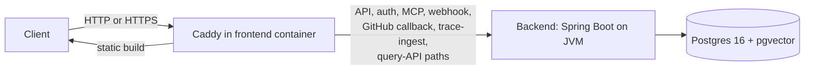

## Topology overview

A self-hosted Tessary deployment runs as a single-node Docker Compose stack. One host runs every service, and Caddy, bundled inside the frontend container, is the only entry point.

Caddy terminates TLS (Transport Layer Security) and serves the static frontend build directly. It proxies a defined set of paths to the backend: the API, auth, MCP (Model Context Protocol), webhook, GitHub callback, trace-ingest, and query-API paths. Every other request is the SPA (single-page application) itself.

The backend is a Spring Boot service running on the JVM (Java Virtual Machine), using Project Loom virtual threads instead of a traditional thread pool. Postgres 16, with the pgvector extension, is the only datastore in the stack. Nothing else in the topology holds data.



Everything else in this stack, including the sandbox-runner, sits outside this request path. The stack ships no telemetry collector; nothing in it exports OpenTelemetry data unless you add a collector yourself. See [Services and state](#services-and-state) for what each one does.

## Services and state

| Service | State | Notes |
| --- | --- | --- |
| postgres | Stateful | Data lives in a volume at `POSTGRES_DATA_DIR`, which defaults to `./.local/postgres`. |
| backend | Stateless | Holds no data of its own; all persistence goes through Postgres. |
| frontend / Caddy | Stateful | Holds ACME (Automatic Certificate Management Environment) certificate state in dedicated volumes. Preserve these across redeploys, or you risk hitting Let's Encrypt rate limits. |
| sandbox-runner | Requires host access | Mounts the host's Docker socket read-write and a host-path work directory, so it can launch sibling containers for agentic RCA (root-cause analysis) and triage. It is not sandboxed from the host Docker daemon. |

The sandbox-runner's access to the host Docker daemon is a deliberate part of how agentic RCA and triage work, not a misconfiguration. Treat the host running Tessary accordingly.

## Single-node by design

<Warning>
  Do not run multiple backend replicas, or two Compose stacks, against the same Postgres database. The backend's rate limiting and executors run in-process and are not distributed-safe. Running more than one backend against one database produces incorrect behavior, not just reduced performance.
</Warning>

Self-hosted Tessary does not support Kubernetes, autoscaling, or multi-node deployment today. The supported shape is one Docker host running `docker compose`.

## Networking

All services share one Docker bridge network. Only the frontend container needs to be reachable from outside the host.

| Component | Reachable from outside the host |
| --- | --- |
| frontend / Caddy (HTTP and HTTPS, default ports 80 and 443) | Yes |
| backend | No, bridge network only |
| sandbox-runner | No, bridge network only |

The exact port Caddy listens on depends on whether TLS is configured; see [TLS](#tls).

## TLS

Whether Caddy serves plain HTTP or automatic HTTPS depends on a single setting: `SITE_DOMAIN`.

Leave `SITE_DOMAIN` unset to run HTTP-only, on `HTTP_PORT` (default 80). This is a reasonable choice for a deployment reachable only over a private network. Set `SITE_DOMAIN` to a real hostname that points at the host and it is served the way `TLS_MODE` says: automatic Let's Encrypt TLS on port 443 (Caddy handles the challenge itself, with no external reverse proxy and no DNS provider), your own certificate mounted into the frontend container, or plain HTTP behind a TLS terminator you already run.

[Custom domain](/self-hosting/custom-domain) walks through the three; the TLS and domain section of [Configuration](/self-hosting/configuration) lists the variables.

## Build from source

The published images are the supported path, and they are what the ten-minute figure on the setup page measures. Building from a bare clone works too, with nothing exported and no task runner:

```bash
git clone https://github.com/tessaryai/tessary.git
cd tessary
docker compose build
docker compose up -d
```

`docker compose build` compiles the backend with Maven and the frontend with Vite inside Docker, so it needs no JDK or Node on the host. It takes as long as your machine's compiler does, which is why no time threshold applies to this path. Every build argument has a working default; the pnpm version the frontend and sandbox-runner images install is pinned in the Dockerfiles and held equal to the repository's own `Taskfile.yml` by a check.
