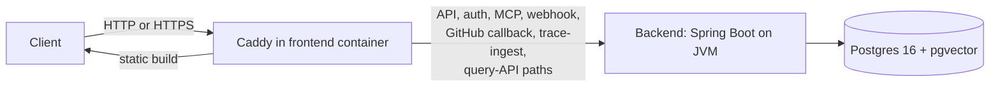

## Topology overview

A self-hosted Tessary deployment runs as a single-node Docker Compose stack. One host runs every service, and Caddy, bundled inside the frontend container, is the only entry point.

Caddy terminates TLS (Transport Layer Security) and serves the static frontend build directly. It proxies a defined set of paths to the backend: the API, auth, MCP (Model Context Protocol), webhook, GitHub callback, trace-ingest, and query-API paths. Every other request is the SPA (single-page application) itself.

The backend is a Spring Boot service running on the JVM (Java Virtual Machine), using Project Loom virtual threads instead of a traditional thread pool. Postgres 16, with the pgvector extension, is the only datastore in the stack. Nothing else in the topology holds data.



Everything else in this stack, including the sandbox-runner, sits outside this request path. The stack ships no telemetry collector; nothing in it exports OpenTelemetry data unless you add a collector yourself. See [Services and state](#services-and-state) for what each one does.

## Services and state

| Service | State | Notes |
| --- | --- | --- |
| postgres | Stateful | Data lives in a volume at `POSTGRES_DATA_DIR`, which defaults to `./.local/postgres`. |
| backend | Stateless | Holds no data of its own; all persistence goes through Postgres. |
| frontend / Caddy | Stateful | Holds ACME (Automatic Certificate Management Environment) certificate state in dedicated volumes. Preserve these across redeploys, or you risk hitting Let's Encrypt rate limits. |
| sandbox-runner | Requires host access | Mounts the host's Docker socket read-write and a host-path work directory, so it can launch sibling containers for agentic RCA (root-cause analysis) and triage. It is not sandboxed from the host Docker daemon. |

The sandbox-runner's access to the host Docker daemon is a deliberate part of how agentic RCA and triage work, not a misconfiguration. Treat the host running Tessary accordingly.

## Single-node by design

<Warning>
  Do not run multiple backend replicas, or two Compose stacks, against the same Postgres database. The backend's rate limiting and executors run in-process and are not distributed-safe. Running more than one backend against one database produces incorrect behavior, not just reduced performance.
</Warning>

Self-hosted Tessary does not support Kubernetes, autoscaling, or multi-node deployment today. The supported shape is one Docker host running `docker compose`.

Because there is only ever one backend, capacity is a question about one host rather than about how many to run.

## Host sizing

Two configurations, both running every service on one host. Which one you want turns on a single decision: whether an accepted batch has to survive a restart of the stack.

| Configuration | Host | Ingest buffer | Run it for |
| --- | --- | --- | --- |
| Starter | 2 vCPU, 8 GB RAM, 50 GB disk | `memory`, the default | Evaluation, one team's traffic, and the [setup](/self-hosting/setup) path on a laptop or a small VM (virtual machine). |
| Durable ingest | 4 vCPU, 16 GB RAM, 200 GB disk | `kafka`, with the bundled Redpanda broker | The smallest host to run when losing a queued batch on restart is not acceptable. |

### Starter

The starter configuration is what the shipped defaults are already tuned for. The backend container is capped at 2 GB and takes 75 percent of that as its heap, the ingest buffer's byte budget is sized against that heap, and Postgres, Caddy and the sandbox runner share the rest of the host. Nothing needs an override file, and `docker compose up -d` on the published configuration is the whole install.

What you accept in exchange is the `memory` buffer's contract: a `200` on `POST /v1/traces` means the batch is queued inside the backend process, and a restart loses what is queued. A full buffer is different, and safe. It answers `503` with `Retry-After`, and stock OTLP (OpenTelemetry Protocol) exporters retry that, so shedding costs latency rather than data. A restart is not a shed, and nothing re-sends a batch the API already accepted.

### Durable ingest

Move to this configuration when that restart window matters, not when you run short of throughput. Turn the durable buffer on as [Configuration](/self-hosting/configuration#ingest-buffer) describes, then give the backend more than its shipped 2 GB, because a larger host does not change that on its own:

```yaml
# tessary.override.yml
services:
  backend:
    mem_limit: 4g
```

```bash
docker compose -f docker-compose.yml -f tessary.override.yml --profile kafka up -d
```

The extra memory covers three things at once: Redpanda's own footprint of about 512 MB, the larger backend heap, and the page cache Postgres relies on as the substrate fills. The fourth core matters most to the drainers, which in `kafka` mode run four at a time by default.

### Growing past either one

Both are starting points rather than limits, and moving between them is a resize and a restart of one host. There is no data migration and no change to the topology on this page.

Move up when the running system says to, rather than in anticipation:

- The `ingest` component of `/actuator/health` reports DOWN because the oldest unprocessed batch is aging past its lag limit.
- Backend CPU stays high enough that drain no longer keeps pace with ingest.
- Postgres and the backend visibly compete for memory on the host. This is the usual reason to give Postgres a machine of its own.

To measure a candidate host instead of estimating it, the load harness in `scripts/bench/` in the repository steps offered load up a ladder and records what was accepted, what reached the database, and what each step cost in CPU.

## Networking

All services share one Docker bridge network. Only the frontend container needs to be reachable from outside the host.

| Component | Reachable from outside the host |
| --- | --- |
| frontend / Caddy (HTTP and HTTPS, default ports 80 and 443) | Yes |
| backend | No, bridge network only |
| sandbox-runner | No, bridge network only |

The exact port Caddy listens on depends on whether TLS is configured; see [TLS](#tls).

## TLS

Whether Caddy serves plain HTTP or automatic HTTPS depends on a single setting: `SITE_DOMAIN`.

Leave `SITE_DOMAIN` unset to run HTTP-only, on `HTTP_PORT` (default 80). This is a reasonable choice for a deployment reachable only over a private network. Set `SITE_DOMAIN` to a real hostname that points at the host and it is served the way `TLS_MODE` says: automatic Let's Encrypt TLS on port 443 (Caddy handles the challenge itself, with no external reverse proxy and no DNS provider), your own certificate mounted into the frontend container, or plain HTTP behind a TLS terminator you already run.

[Custom domain](/self-hosting/custom-domain) walks through the three; the TLS and domain section of [Configuration](/self-hosting/configuration) lists the variables.

## Build from source

The published images are the supported path, and they are what the ten-minute figure on the setup page measures. Building from a bare clone works too, with nothing exported and no task runner:

```bash
git clone https://github.com/tessaryai/tessary.git
cd tessary
docker compose build
docker compose up -d
```

`docker compose build` compiles the backend with Maven and the frontend with Vite inside Docker, so it needs no JDK or Node on the host. It takes as long as your machine's compiler does, which is why no time threshold applies to this path. Every build argument has a working default; the pnpm version the frontend and sandbox-runner images install is pinned in the Dockerfiles and held equal to the repository's own `Taskfile.yml` by a check.
